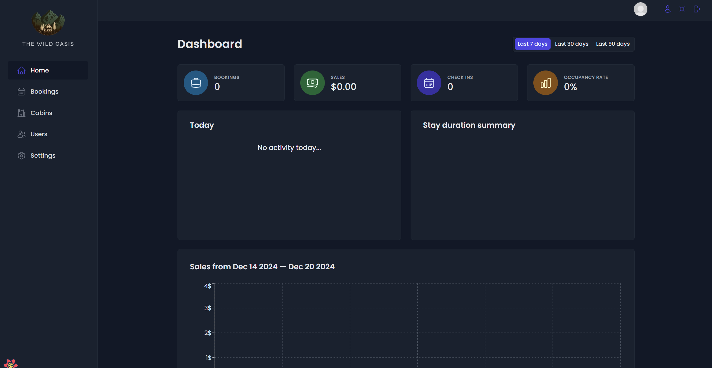
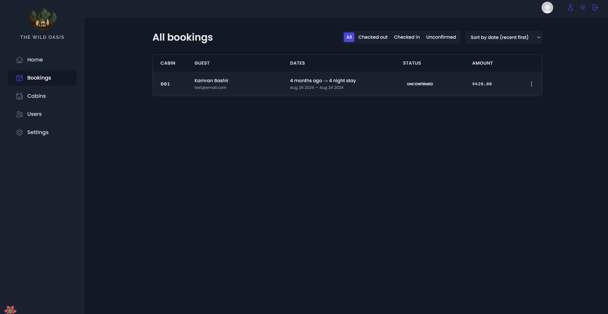
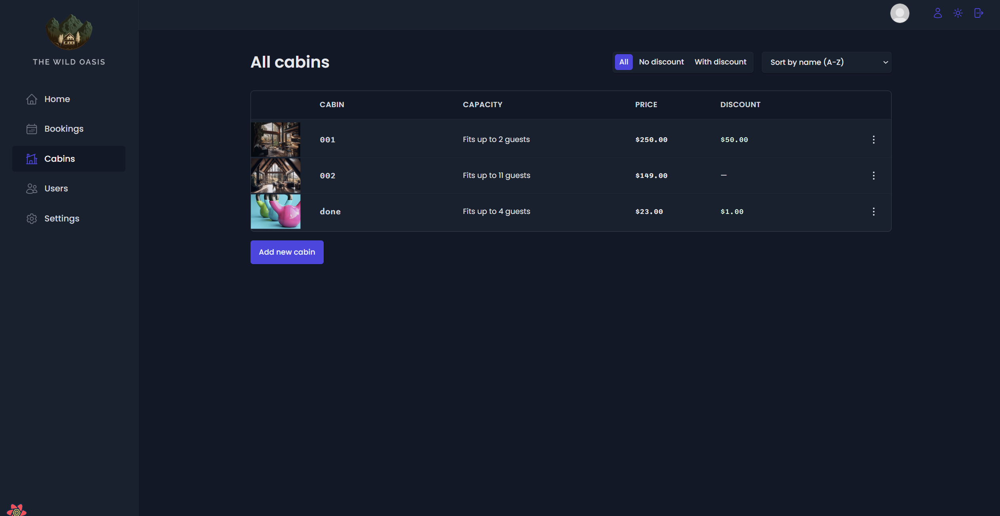
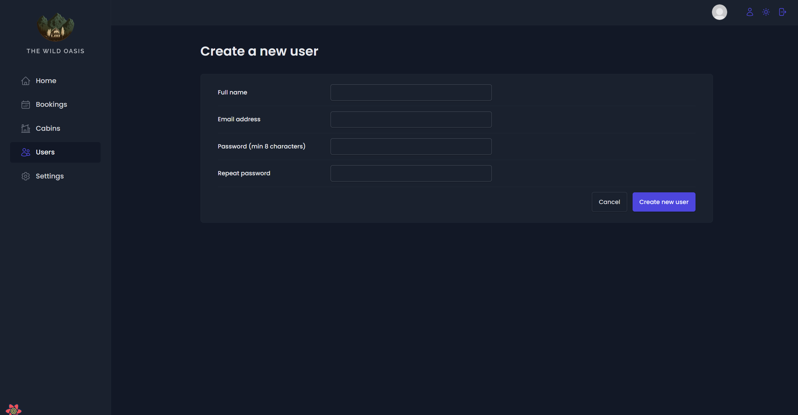

# The Wild Oasis

Welcome to the repository for The Wild Oasis, a comprehensive management system designed for hospitality businesses specializing in cabin rentals. This project aims to streamline the operation of such facilities by providing a robust and intuitive interface for managing bookings, customer interactions, and administrative tasks.

## Technology Stack

The Wild Oasis is built with the following technologies:

- **React**: A JavaScript library for building user interfaces.
- **React Router**: For handling in-app routing.
- **Vite**: A modern frontend build tool that provides a faster and leaner development experience.
- **Supabase**: An open source Firebase alternative providing all the backend services you need.
- **React Query**: A library for fetching, caching, and updating data in React applications with minimal configuration.
- **Styled Components**: For styling React components with enhanced CSS capabilities.
- **Recharts**: A composable charting library built on React components.
- **React Hook Form**: Efficient, flexible, and extensible forms with easy-to-use validation.
- **React Hot Toast**: Lightweight and customizable notifications for React applications.
- **Date-fns**: Modern JavaScript date utility library.
- **ESLint**: The pluggable linting utility for JavaScript and JSX.

## Features

### Dashboard Overview

- **Quick Stats**: View bookings, sales, check-ins, occupancy rates, and more at a glance.
- **Activity Feed**: Monitor daily activities and updates within the system.

### Booking Management

- **Create, View, and Update Bookings**: Full management of bookings with options to filter by status (checked in, checked out, unconfirmed).
- **Booking Insights**: Analyze data with built-in graphical representations using Recharts.

### Cabin Management

- **Cabin Details**: Manage cabin details such as capacity, price, and availability.
- **Add and Edit Cabins**: Easily add new cabins or update existing ones with images and descriptions.

### User Administration

- **User Profiles**: Create and manage user accounts, including role-based access control.
- **User Activity Logs**: Track user actions and changes within the platform.

